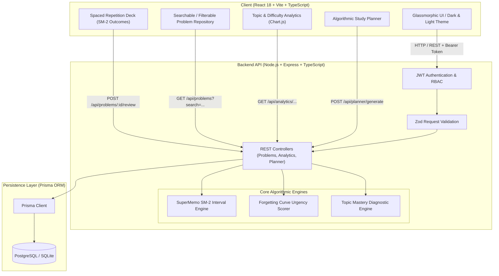

# ⚡ Track My DSA 2.0

> An industry-grade, full-stack DSA progress tracker powered by an **enhanced SuperMemo (SM-2) Spaced-Repetition Algorithm**, **Topic Mastery Analytics**, and **Dynamic Study Session Planning**.

[](https://github.com/Shrehak/track-my-dsa/actions/workflows/ci.yml)
[](https://opensource.org/licenses/MIT)
[](https://www.typescriptlang.org/)
[](https://nodejs.org/)
[](https://www.prisma.io/)

---

## 🎯 Motivation & Engineering Highlights

Preparing for software engineering interviews often leads to the **"forgetting curve" trap**: candidates solve hundreds of LeetCode problems only to blank out on standard DP, graph, or tree patterns a month later.

**Track My DSA 2.0** solves this by combining full-stack architecture with cognitive science:
1. **Algorithmic Spaced Repetition (Modified SM-2)**: Dynamically computes expanding intervals and difficulty-weighted easiness factors to guarantee long-term neural retention.
2. **Backlog Urgency Scoring**: Prioritizes overdue problems based on days elapsed since the forgetting threshold and initial confidence level.
3. **Weak-Topic Diagnostics**: Calculates topic mastery scores ($0-100\%$) and provides automated prescriptions for weak domains before interview rounds.
4. **Algorithmic Study Planner**: Prescribes balanced practice sessions based on available minutes, overdue revisions, and weak-topic drills.
5. **Production-Ready Engineering**: Type-safe end-to-end (TypeScript), RESTful API with Zod validation, JWT authentication, centralized error handling, Prisma ORM (SQLite / PostgreSQL), and 100% passing test coverage with Jest and Supertest.

---

## 🏗️ System Architecture



---

## 🧠 Spaced Repetition (SM-2) Mathematical Model

The application implements a customized version of the **SuperMemo SM-2 algorithm** adapted for coding problems:

### 1. Easiness Factor ($EF$)
Initial $EF = 2.5$. After each review quality rating $q \in [1, 5]$:
$$EF' = \max\left(1.3, EF + \left(0.1 - (5 - q) \cdot (0.08 + (5 - q) \cdot 0.02)\right)\right)$$

### 2. Interval Progression ($I$ in days)
Adjusted by difficulty multipliers ($\text{Easy}: 1.2$, $\text{Medium}: 1.0$, $\text{Hard}: 0.8$):
- If $q < 3$ (Failed / Blackout): $I = 1\text{ day}$, $\text{repetitionCount} = 0$, status resets to `LEARNING`.
- If $q \ge 3$:
  - $n = 0 \implies I = 1\text{ day}$
  - $n = 1 \implies I = \max(2, \text{round}(3 \times \text{multiplier}))$
  - $n \ge 2 \implies I = \max(I_{prev} + 1, \text{round}(I_{prev} \times EF' \times \text{multiplier}))$
- When $n \ge 4$ with high quality, problem transitions to `MASTERED`.

### 3. Backlog Urgency Score
For problems past their scheduled revision date:
$$\Delta t = \text{daysOverdue} = \frac{\text{now} - \text{nextRevisionDate}}{86400000}$$
$$\text{Urgency Score} = \Delta t \times (6 - \text{confidence}) \times \text{difficultyWeight}$$

### 4. Topic Mastery Formula
$$\text{Mastery Score} = \min\left(100, \left(\frac{\text{avgConfidence}}{5} \times 50\right) + (\text{masteredRatio} \times 35) - (\text{overdueRatio} \times 15)\right)$$
Topics with Mastery Score $< 55\%$ are flagged as **Weak Areas** with automated drill recommendations.

---

## 📡 REST API Specification

| Method | Endpoint | Description | Auth |
| :--- | :--- | :--- | :---: |
| `POST` | `/api/auth/register` | Register new candidate account | Public |
| `POST` | `/api/auth/login` | Log in with email and password | Public |
| `POST` | `/api/auth/demo` | 1-Click Guest demo login for reviewers | Public |
| `GET` | `/api/auth/me` | Fetch authenticated user profile & XP | Bearer |
| `GET` | `/api/problems` | List problems with pagination, search & filters | Bearer |
| `POST` | `/api/problems` | Log a newly solved problem | Bearer |
| `GET` | `/api/problems/:id` | Fetch problem details & revision history | Bearer |
| `PUT` | `/api/problems/:id` | Update problem notes, topic, or difficulty | Bearer |
| `DELETE` | `/api/problems/:id` | Delete problem | Bearer |
| `POST` | `/api/problems/:id/review` | Submit SM-2 review (Again, Hard, Good, Easy) | Bearer |
| `GET` | `/api/analytics/dashboard` | Solved metrics, streak, level, 7-day activity | Bearer |
| `GET` | `/api/analytics/weak-topics` | Algorithmic topic diagnostics & recommendations | Bearer |
| `GET` | `/api/analytics/backlog` | Priority revision queue sorted by urgency score | Bearer |
| `POST` | `/api/planner/generate` | Generate optimal practice schedule for $T$ mins | Bearer |
| `POST` | `/api/planner/:id/complete` | Complete study session and claim +25 bonus XP | Bearer |

---

## 🛠️ Tech Stack

- **Frontend**: React 18, Vite, TypeScript, Lucide Icons, Chart.js, React-ChartJS-2, Modern Glassmorphism CSS.
- **Backend**: Node.js, Express, TypeScript, Zod, bcryptjs, jsonwebtoken, CORS.
- **ORM & Database**: Prisma ORM, SQLite (local zero-setup), PostgreSQL (production compatible).
- **Testing**: Jest, Supertest, ts-jest (19 automated unit & integration tests).
- **CI/CD**: GitHub Actions (`.github/workflows/ci.yml`).

---

## 🚀 Quickstart & Local Setup

### Prerequisites
- Node.js 18+ and npm installed

### 1. Clone & Install Dependencies
```bash
git clone https://github.com/Shrehak/track-my-dsa.git
cd track-my-dsa

# Install server dependencies
cd server
npm install

# Install client dependencies
cd ../client
npm install
```

### 2. Setup Database & Seed
```bash
cd ../server
npx prisma generate
npx prisma db push
npx tsx prisma/seed.ts
```

### 3. Run Automated Tests
```bash
npm test
```

### 4. Start Development Servers
In two separate terminals:
```bash
# Terminal 1: Backend (port 5000)
cd server
npm run dev

# Terminal 2: Frontend (port 5173)
cd client
npm run dev
```

Open your browser at **`http://localhost:5173`**.  
Click **"1-Click Demo"** for instant access with pre-seeded data!

---

## 🏛️ Legacy Project

The original client-only static HTML/CSS/JS version is safely preserved in the [`legacy/`](./legacy) folder for historical reference.

---

## 📄 License
MIT License. Crafted with precision for high-impact software engineering candidate portfolios.
